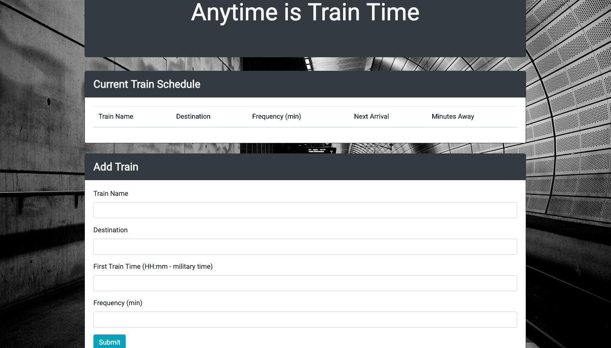

# Train-Scheduler

## Quick start
Open [Train Scheduler](https://victoire44.github.io/Train-Scheduler/) in your browser.

## Presentation
The purpose of this assignment is to create a Train scheduler. 
I use [Firebase](https://firebase.google.com/) to store the train data. 
 
When you complete the form and submit it, a new row appears in a table. 
It displays the Train Name, the Destination, the Frequency in minutes and calculates:
* the time at which the next train will departs, in function of the current time
* the remaining minutes before the next train.
 
For these calculations, I use [Moment.js](https://momentjs.com/)

 
When the Frequency or First Train Time inputs are not completed, the "Next Arrival" and "Minutes Away" columns are mark Unknown. 
 
It's possible to delete the row by clicking on the cross. 

## Technologies Used

* [HTML](https://developer.mozilla.org/en-US/docs/Web/HTML)
* [CSS](https://developer.mozilla.org/en-US/docs/Web/CSS)
* [Bootstrap](https://getbootstrap.com/)
* [JavaScript](https://developer.mozilla.org/en-US/docs/Web/JavaScript)
* [jQuery](https://jquery.com/)

## Author
Victoire Baron
